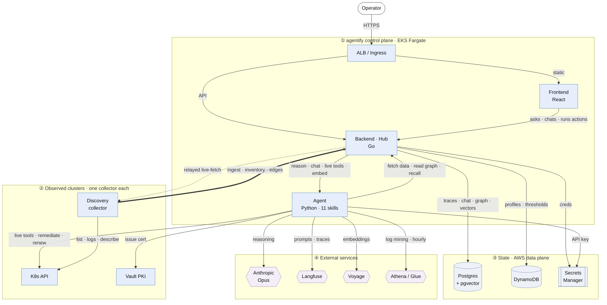

# ARCHITECTURE.md – Agentify runtime design and deployment

> This document describes the **runtime architecture** of agentify — how the system
> is layered, coded, deployed, and operates. It complements `context-mesh/` which
> describes the *product behavior* (policies, specs, decisions about what the
> system does). Start here to understand the implementation.

## 0. Critical traffic flow — the whole system in one picture



**Read it as a map of connections, not of requests.** Every connection appears
exactly once, labelled with what it carries. That is what keeps a single picture
legible: the 16 individual flows drawn as separate lanes would be ~90 edges. To
follow one flow end to end, open
[`docs/architecture-map.html`](docs/architecture-map.html), which overlays them
one at a time; for strict ordering, [`docs/SEQUENCE_FLOWS.md`](docs/SEQUENCE_FLOWS.md).

### What each connection actually carries

| Connection | Label | Endpoints |
|---|---|---|
| Operator → ALB | HTTPS | the ALB hostname is account-specific and changes when the ingress is recreated — never hardcode it |
| ALB → Frontend / Backend | static · API | `/` to the UI; `/api/*` and `/admin/*` to the Hub |
| Frontend → Backend | asks · chats · runs actions | `POST /api/query`, `POST /api/chat/sessions/{id}/messages`, `POST /api/live-query`, `POST /admin/remediation/{id}/approve`, `POST /admin/certs/renew` |
| Backend → Agent | reason · chat · live tools · embed | `POST /reason`, `POST /reason-chat`, `POST /live-tool-call`, `POST /embed` |
| Agent → Backend | fetch data · read graph · recall | `POST /api/agent/fetch`, `GET /api/service-dependencies`, `GET /api/incidents/similar`, `GET /api/resolve-cluster`, `GET /api/cluster-service-selectors`, `GET /admin/tracked`, `POST /api/live-fetch` |
| Backend → Postgres | traces · chat · graph · vectors | `traces`, `chat_sessions`, `service_dependencies`, `incident_embeddings` (pgvector), `cluster_services` |
| Backend → DynamoDB | profiles · thresholds | pod profiles and tuning values, kept out of code |
| Backend / Agent → Secrets Manager | creds · API key | DB credentials, collector tokens, the Anthropic key. **Updating a secret does not reach a running pod** — the value is read from env, sourced from a K8s Secret only the deploy workflow recreates |
| Agent → Anthropic | reasoning | one Opus call per Pattern-A skill; 1–N for the Pattern-B loop; **zero** for every deterministic path |
| Agent → Langfuse | prompts · traces | prompts are resolved per request by label, not baked into the image; one observation per call or chat turn |
| Agent → Voyage | embeddings | 512-dim vector per diagnosis, for semantic recall |
| Agent → Athena/Glue | log mining · hourly | the centralized dependency miner, scanning the current hour partition |
| Agent → K8s API | live tools · remediate · renew | live reads, approved remediation, TLS Secret writes |
| Agent → Vault | issue cert | PKI engine, on demand |
| Collector → K8s API | list · logs · describe | 5 pods per namespace, last 200 log lines per scan |
| **Collector → Backend** (bold) | ingest · inventory · edges | `GET /api/collector/connect` (outbound WSS), `POST /api/ingest`, `/api/cluster-inventory`, `/api/cluster-health`, `/api/cluster-ingress`, `/api/service-dependencies` |
| Backend ⇢ Collector (dotted) | relayed live-fetch | the Hub **never dials a cluster**. It answers down the socket the collector opened, so no inbound access or cross-account credential is ever needed |

### The five critical paths through it

| # | Path | Route | Model calls |
|---|---|---|---|
| 1 | **Ask — fast path** | Operator → ALB → FE → BE → Postgres → BE → FE | **0** — answered deterministically |
| 2 | **Ask — reasoned** | … → BE → Agent ⇄ BE (parallel prefetch) → Langfuse → Anthropic → BE → Postgres → FE | **1** |
| 3 | **Chat** | FE → BE → Agent ⇄ BE (tool loop) → Anthropic ×2 → Langfuse → BE → Postgres | **2**, or **0** for a dependency question |
| 4 | **Continuous ingest** | Collector → K8s API → Collector → BE → Postgres, every 60s | **0** |
| 5 | **Act** | Agent proposes → BE → Postgres → *human approves* → BE → Agent → K8s API | **0** on the execute leg |

Latency and cost live almost entirely in paths 2 and 3. Paths 1, 4 and 5 touch no
model at all — which is the point of [ADR 0006](context-mesh/decisions/0006-two-tier-query-path.md)
and of every deterministic skill since.

## 1. Runtime architecture (layers and data flow)

```
┌──────────────────────────────────────────────────────────────────┐
│              Frontend Layer                                      │
│  ┌───────────────────┐        ┌──────────────────────────────┐  │
│  │  Ops Dashboard    │        │  Admin Config UI            │  │
│  │  (React)          │        │  (React)                     │  │
│  │  - Chat interface │        │  - Add/edit integrations     │  │
│  │  - Quick queries  │        │  - Manage data sources       │  │
│  │  - Status view    │        │  - View adapter logs         │  │
│  └───────────────────┘        └──────────────────────────────┘  │
└────────────────────────────────┬─────────────────────────────────┘
                                 │ WebSocket + REST
┌────────────────────────────────▼─────────────────────────────────┐
│              API Gateway Layer (AWS ALB)                         │
│              - SSL termination                                   │
│              - Path-based routing                                │
│              - Rate limiting                                     │
└────────────────┬────────────────────────┬───────────────────────┘
                 │                        │
    ┌────────────▼───────────┐  ┌────────▼──────────────────┐
    │  Backend Core (Go)     │  │  Agent Layer (Python)    │
    │  - Orchestrator        │  │  - Claude SDK            │
    │  - API handlers        │  │  - System prompts        │
    │  - WebSocket handler   │  │  - Tool calling          │
    │  - Pod registry mgmt   │  │  - Reasoning             │
    └────────┬───────────────┘  └────────┬──────────────────┘
             │                           │
    ┌────────▼───────────────────────────▼──────────────┐
    │  Event Processing & Routing                      │
    │  - SQS queue (async tasks)                       │
    │  - Event normalizer                              │
    │  - Pod ingestion layer (spec 001)                │
    └────────┬──────────────────────────────────────────┘
             │
    ┌────────▼──────────────────────────────────────────┐
    │  Adapter Workers (Python / Go)                    │
    │  - K8s event watcher                              │
    │  - CRM sync (future)                              │
    │  - Webhook receiver                               │
    │  - Certificate scraper                            │
    └────────┬──────────────────────────────────────────┘
             │
    ┌────────▼──────────────────────────────────────────┐
    │  Storage Layer (Managed AWS services)             │
    │  ┌──────────────┬──────────┬──────────────────┐  │
    │  │ RDS Postgres │ Redis KV │ Pinecone Vector │  │
    │  ├──────────────┼──────────┼──────────────────┤  │
    │  │ DynamoDB     │ S3       │ Secrets Manager  │  │
    │  └──────────────┴──────────┴──────────────────┘  │
    └───────────────────────────────────────────────────┘
             │
    ┌────────▼──────────────────────────────────────────┐
    │  Refinement Loop (observer + decision engine)     │
    │  - Monitor query patterns & stats                 │
    │  - Decide on pod splits/merges/migrations         │
    │  - Execute decisions (async)                      │
    └──────────────────────────────────────────────────┘
             │
    ┌────────▼──────────────────────────────────────────┐
    │  Observability                                    │
    │  - CloudWatch Logs (structured JSON)              │
    │  - CloudWatch Metrics + Alarms                    │
    │  - X-Ray distributed tracing                      │
    └──────────────────────────────────────────────────┘
```

## 2. Code structure (`src/` folder layout)

```
src/
├── backend/                        # Go application
│   ├── cmd/
│   │   └── agentify/
│   │       └── main.go            # entry point
│   ├── internal/
│   │   ├── api/                   # HTTP handlers
│   │   │   ├── handlers.go        # /query, /admin/*, /chat
│   │   │   ├── middleware.go      # auth, rate-limit, logging
│   │   │   └── websocket.go       # chat WebSocket handler
│   │   ├── orchestrator/          # core routing + pod management
│   │   │   ├── router.go          # route query → pod(s)
│   │   │   ├── correlator.go      # fan-out + combine results
│   │   │   ├── registry.go        # pod-registry management
│   │   │   └── cache.go           # query result caching
│   │   ├── models/                # domain models (shared with other services)
│   │   │   ├── pod.go
│   │   │   ├── event.go
│   │   │   ├── query.go
│   │   │   └── k8fy/
│   │   │       ├── service.go
│   │   │       ├── pod.go
│   │   │       ├── health.go
│   │   │       └── certificate.go
│   │   ├── storage/               # pod connectors
│   │   │   ├── relational/        # Postgres
│   │   │   ├── kv/                # Redis
│   │   │   ├── vector/            # Pinecone
│   │   │   ├── timeseries/        # Prometheus/TSDB
│   │   │   └── logs/              # Elasticsearch/Loki
│   │   ├── config/                # configuration
│   │   │   ├── env.go
│   │   │   ├── pod_profiles.go    # event profiles from context-mesh
│   │   │   └── aws.go             # AWS SDK setup
│   │   └── telemetry/             # observability
│   │       ├── logger.go
│   │       ├── metrics.go
│   │       └── tracer.go
│   ├── go.mod
│   └── go.sum
│
├── agent/                         # Python application (FastAPI)
│   ├── main.py                    # entry point
│   ├── app.py                     # FastAPI app setup + /reason endpoint
│   ├── metrics.py                 # Prometheus token-usage metrics (ADR 0011)
│   ├── k8fy/
│   │   ├── agent.py               # K8fyAgent: base + _reason_pattern_a() + _fetch()
│   │   ├── prompt_manager.py      # Langfuse-first prompt fetcher; local fallback
│   │   ├── prompts.py             # local fallback strings (source of truth when Langfuse absent)
│   │   ├── tools.py               # 7 Claude tool definitions
│   │   └── skills/                # spec 010 — Pattern A skill router (ADR 0017)
│   │       ├── router.py          # SkillRouter: intent → skill dispatch table
│   │       ├── health_check.py    # HealthSkill — pre-fetch service_health + pod_events
│   │       ├── cert_audit.py      # CertAuditSkill — pre-fetch certificates
│   │       ├── change_history.py  # ChangeHistorySkill — pre-fetch change_history
│   │       ├── restart_trend.py   # RestartTrendSkill — pre-fetch metrics_history
│   │       └── diagnose.py        # DiagnoseSkill — parallel pre-fetch 5 signals, Opus 4.8
│   │   # deterministic health/cert rules now live in the Go backend's
│   │   # internal/orchestrator/evaluator (Tier-1) — see spec 003
│   ├── scripts/
│   │   └── migrate_prompts_to_langfuse.py  # one-time: push local prompts to Langfuse
│   ├── adapters/                  # adapter-specific agents (future)
│   │   └── __init__.py
│   ├── models/                    # Pydantic models (shared)
│   │   ├── health.py
│   │   ├── query.py
│   │   └── response.py
│   ├── config/
│   │   ├── settings.py
│   │   └── claude_client.py
│   ├── requirements.txt
│   └── Dockerfile
│
├── adapters/                      # Integration adapters
│   ├── k8fy/                      # Kubernetes adapter
│   │   ├── main.py                # entry point (reads SQS, emits events)
│   │   ├── k8s_client.py          # K8s API wrapper
│   │   ├── event_watcher.py       # watch events
│   │   ├── cert_scraper.py        # scrape certificates
│   │   ├── normalizer.py          # canonical event emission
│   │   └── requirements.txt
│   ├── crm/                       # (future) CRM adapter
│   └── webhooks/                  # webhook receiver
│
├── frontend/                      # TypeScript / React
│   ├── src/
│   │   ├── components/
│   │   │   ├── ChatInterface.tsx  # ops dashboard chat
│   │   │   ├── AdminPanel.tsx     # config UI
│   │   │   ├── StatusDashboard.tsx # health overview
│   │   │   └── ...
│   │   ├── services/
│   │   │   ├── api.ts             # API client (fetch + WebSocket)
│   │   │   └── auth.ts            # auth provider
│   │   ├── types/
│   │   │   ├── query.ts
│   │   │   ├── response.ts
│   │   │   └── integration.ts
│   │   ├── App.tsx
│   │   └── index.tsx
│   ├── package.json
│   └── vite.config.ts
│
├── shared/                        # Shared libraries / contracts
│   ├── models/
│   │   ├── health.go / health.ts  # health model (Go + TS versions)
│   │   ├── pod.go / pod.ts
│   │   └── query.go / query.ts
│   └── constants/
│       └── event_profiles.yaml    # event profiles (shared)
│
├── infra/                         # Infrastructure as Code (Terraform / CDK)
│   ├── aws/
│   │   ├── main.tf                # ALB, ECS, RDS, etc.
│   │   ├── ecs.tf                 # Fargate task definitions
│   │   ├── rds.tf                 # Postgres setup
│   │   ├── elasticache.tf         # Redis setup
│   │   ├── dynamodb.tf            # DynamoDB tables
│   │   ├── secrets.tf             # Secrets Manager
│   │   └── outputs.tf
│   ├── docker/
│   │   ├── Dockerfile.backend     # Go backend
│   │   ├── Dockerfile.agent       # Python agent
│   │   ├── Dockerfile.adapter     # Python adapter
│   │   └── Dockerfile.frontend    # React app
│   └── README.md                  # infra deployment guide
│
├── tests/                         # Test suite
│   ├── unit/
│   ├── integration/
│   └── e2e/
│
├── docs/                          # Additional docs
│   ├── DEPLOYMENT.md              # step-by-step AWS deployment
│   ├── OPERATIONS.md              # runbooks
│   └── DEVELOPMENT.md             # local dev setup
│
└── Makefile                       # common tasks (build, test, deploy)
```

## 3. Layer responsibilities and communication

### Backend (Go)

**Responsible for:**
- HTTP routing, WebSocket connections
- Query intent parsing
- Orchestration: route query → pod(s)
- Correlation: combine results from multiple pods
- Response formatting
- Admin CRUD for integrations

**Communications:**
- Receives HTTP/WebSocket from frontend
- Calls Python agent service (HTTP POST)
- Reads/writes pod storage (SQL, Redis, Pinecone, TSDB, logs)
- Emits events to SQS for async processing
- Reads pod-registry from DynamoDB

### Agent Layer (Python, containerized)

**Responsible for:**
- Claude SDK integration
- System prompt management
- Tool definition and calling
- Reasoning over data (health judgment, decisions)
- Response synthesis

**Communications:**
- Receives POST requests from Go backend
- Calls Claude API (with prompt caching for cost savings)
- Returns structured JSON response
- Logs reasoning steps to CloudWatch

### Adapters (Python / Go)

**Responsible for:**
- Source system integration (K8s API, CRM APIs, etc.)
- Event normalization (to canonical format)
- Emission to ingestion layer

**Communications:**
- Poll SQS for tasks or run on schedule
- Call external APIs (K8s, Salesforce, etc.)
- Emit canonical events to ingestion queue
- Log errors and metrics to CloudWatch

### Refinement Loop (Python or Go)

**Responsible for:**
- Monitor query patterns (from pod stats)
- Detect split/merge/migrate opportunities
- Execute decisions (async)

**Communications:**
- Reads stats from pod storage layer
- Reads pod-registry from DynamoDB
- Emits decisions to SQS
- Updates pod-registry when changes complete

## 4. AWS deployment architecture (enterprise, cost-optimized)

```
┌─────────────────────────────────────────────────────────────┐
│                    AWS Account                              │
├─────────────────────────────────────────────────────────────┤
│
│  ┌─────────────────────────────────────────────────────────┐
│  │  Networking & CDN                                       │
│  │  - Route 53 (DNS)                                       │
│  │  - CloudFront (CDN for frontend)                        │
│  │  - ALB (Application Load Balancer)                      │
│  │  - VPC (with public + private subnets)                  │
│  └────────────────────┬────────────────────────────────────┘
│                       │
│  ┌────────────────────▼────────────────────────────────────┐
│  │  ECS Cluster (Fargate launch type)                      │
│  │  ┌─────────────────────────────────────────────────────┐
│  │  │ Service: Backend (Go)                               │
│  │  │ - Task CPU: 0.5 vCPU, Memory: 1 GB (start)          │
│  │  │ - Desired: 2 tasks (min HA), Max: 10                │
│  │  │ - Auto-scale: target CPU 70%                        │
│  │  └─────────────────────────────────────────────────────┘
│  │  ┌─────────────────────────────────────────────────────┐
│  │  │ Service: Agent (Python)                             │
│  │  │ - Task CPU: 0.25 vCPU, Memory: 512 MB (start)       │
│  │  │ - Desired: 1 task (can be 0 if serverless later)    │
│  │  │ - Auto-scale: on request queue length               │
│  │  └─────────────────────────────────────────────────────┘
│  │  ┌─────────────────────────────────────────────────────┐
│  │  │ Service: Adapters (Python / Go)                     │
│  │  │ - Task CPU: 0.25–0.5 vCPU, Memory: 512 MB           │
│  │  │ - Desired: 1 per adapter (start minimal)            │
│  │  │ - Auto-scale on SQS queue depth                     │
│  │  └─────────────────────────────────────────────────────┘
│  └─────────────────────────────────────────────────────────┘
│
│  ┌─────────────────────────────────────────────────────────┐
│  │  Data Services (Managed)                                │
│  │  ┌──────────────────┬──────────────┬─────────────────┐ │
│  │  │ RDS Postgres     │ ElastiCache  │ DynamoDB        │ │
│  │  │ - Multi-AZ       │ Redis        │ - Pods table    │ │
│  │  │ - db.t3.micro    │ - t3.micro   │ - Integrations  │ │
│  │  │ - 20 GB storage  │ - 512 MB     │ - Configs       │ │
│  │  └──────────────────┴──────────────┴─────────────────┘ │
│  │  ┌──────────────────┬──────────────┬─────────────────┐ │
│  │  │ S3 (Storage)     │ Secrets Mgr  │ Pinecone        │ │
│  │  │ - Pod registry   │ - K8s tokens │ - Vector store  │ │
│  │  │ - Config backups │ - API keys   │ - SaaS          │ │
│  │  └──────────────────┴──────────────┴─────────────────┘ │
│  └─────────────────────────────────────────────────────────┘
│
│  ┌─────────────────────────────────────────────────────────┐
│  │  Async Processing                                       │
│  │  - SQS queue (integration tasks, ingestion events)      │
│  │  - EventBridge (scheduled refinement loop, scraping)    │
│  └─────────────────────────────────────────────────────────┘
│
│  ┌─────────────────────────────────────────────────────────┐
│  │  Observability                                          │
│  │  - CloudWatch Logs (all services)                       │
│  │  - CloudWatch Metrics (custom metrics)                  │
│  │  - CloudWatch Alarms (high error rate, slow queries)    │
│  │  - X-Ray (optional: distributed traces)                 │
│  └─────────────────────────────────────────────────────────┘
│
└─────────────────────────────────────────────────────────────┘
```

**Cost breakdown (monthly estimate, MVP):**
- ECS Fargate: ~$50 (3 tasks × 0.25–0.5 vCPU, 30 days)
- RDS t3.micro: ~$30
- ElastiCache t3.micro: ~$25
- DynamoDB: ~$10 (on-demand, low volume)
- S3: ~$1
- Data transfer: ~$5
- **Total: ~$120/month** (scales linearly with load until reaching ALB/RDS limits)

**Enterprise HA (no major refactoring):**
- Add RDS read replica (RDS Multi-AZ)
- Upgrade to db.t3.small (~$60/mo)
- Add ElastiCache cluster mode (Redis Cluster)
- Upgrade Fargate tasks to 1 vCPU, 2 GB RAM
- Add NAT Gateway for private subnets (egress to external APIs)
- **Total: ~$500–800/month** for HA across AZs

## 5. Integration flow (end-to-end)

```
1. K8s Adapter (runs on schedule via EventBridge)
   │
   ├─► Calls K8s API: GET /api/v1/pods
   │
   ├─► Normalizes event:
   │   {
   │     "event_namespace": "k8fy.live-state",
   │     "pod_id": "payment-svc-abc123",
   │     "phase": "Running",
   │     "ready": true,
   │     "restarts": 0,
   │     "timestamp": "2026-05-30T10:00:00Z"
   │   }
   │
   └─► Emits to SQS ingestion queue
       │
       ▼
2. Event Ingestion Service (consumes SQS)
   │
   ├─► Routes via storage-strategy (see context-mesh)
   │   → "k8fy.live-state" with access pattern "point-lookup"
   │   → store in Redis (KV)
   │
   ├─► Updates pod stats (event_count, freshness)
   │
   └─► Emits observation to refinement loop
       │
       ▼
3. Refinement Loop (runs periodically)
   │
   ├─► Observes: "k8fy.live-state" has grown 10k pods"
   │
   ├─► Decides: "split by namespace" (ADR 0002)
   │
   └─► Executes: create index pod, populate shard map, update DynamoDB
       │
       ▼
4. Frontend / Admin: queries via Go backend
   │
   ├─► GET /admin/integrations
   │   → returns list of adapters, last sync time, event count
   │
   ├─► POST /api/query "health of service X"
   │   → orchestrator routes to k8fy.live-state pod(s)
   │   → fetches from Redis
   │   → calls Python agent for reasoning
   │   → returns answer with sources + confidence
```

## 6. Admin interface configuration flow

```
Admin User → Frontend (React) → Go API → DynamoDB

1. POST /admin/integrations
   {
     "name": "Prod K8s Cluster",
     "type": "kubernetes",
     "config": {
       "api_endpoint": "https://k8s-prod.internal:6443",
       "auth_type": "bearer_token",
       "token_secret_arn": "arn:aws:secretsmanager:...",
       "namespaces": ["prod", "staging"],
       "scrape_interval": "30s"
     }
   }

2. Go backend:
   - Validates config (format, required fields)
   - Stores in DynamoDB (integrations table)
   - Stores secret token in Secrets Manager
   - Emits event: "integration_added" → SQS
   - Returns 201 Created

3. SQS consumer (or EventBridge):
   - Reads event
   - Spins up K8s adapter container if not running
   - Adapter reads config from DynamoDB
   - Adapter runs first scrape
   - Updates status in DynamoDB: "active" + "last_heartbeat"

4. Frontend polls:
   - GET /admin/integrations/k8s-prod-cluster-01
   - Shows status (active | error), last heartbeat, event count
```

## 7. Chat interface flow (ops user interaction)

```
Ops User (browser) → React Frontend → Go WebSocket → Agent → Storage

1. User types in chat: "Is the payments service healthy?"

2. Frontend emits:
   {
     "type": "chat_message",
     "text": "Is the payments service healthy?",
     "context": {
       "namespace": "prod",
       "cluster": "us-west-2"
     }
   }

3. Go backend receives on WebSocket:
   - Parses intent: "health_check"
   - Routes query: "payments" → k8fy.live-state:prod pod
   - Fetches data from Redis
   - Calls Python agent: POST http://agent:8000/reason
     {
       "intent": "health_check",
       "data": { ... },
       "context": { ... }
     }

4. Python agent (Claude):
   - System prompt: "You are a Kubernetes expert..."
   - Data: pod phase, ready condition, restart count, events
   - Claude reasons: "This service is Healthy because..."
   - Returns: { "answer": "...", "status": "healthy", "confidence": 0.99 }

5. Go formats response and sends back over WebSocket:
   {
     "type": "response",
     "answer": "Service payments is Healthy...",
     "status": "healthy",
     "sources": ["k8fy.live-state:prod"],
     "confidence": 0.99,
     "actions": [
       { "label": "Show metrics", "action": "query_metrics" },
       { "label": "View events", "action": "query_events" }
     ]
   }

6. Frontend renders:
   - Status badge (green Healthy)
   - Answer text
   - Source pods (clickable for details)
   - Action buttons
```

## 8. Cost optimization strategies

| Scenario | Strategy |
|----------|----------|
| **Dev/Testing** | Run with minimal: 1 backend (0.25 vCPU), 1 agent (0.25 vCPU), 1 adapter (0.25 vCPU). Total ~$30/mo. |
| **Production (low volume)** | 2 backend tasks (HA), 1 agent, 1 adapter. Total ~$120/mo. |
| **Production (scale)** | 10+ backend tasks (auto-scale), 3+ agents, multiple adapters. RDS multi-AZ. ~$500+/mo. |
| **Reduce compute costs** | Cache query results (1 hour TTL); batch adapter scrapes (every 5min, not per-event). |
| **Reduce storage costs** | Archive old events to S3 Glacier (after 30d); move cold data out of hot stores. |
| **Reduce agent costs** | Use Claude prompt caching (saves ~90% of repeated queries). |

## 9. Deployment & operations

See `infra/` folder and `docs/DEPLOYMENT.md` for:
- Terraform IaC (all AWS resources)
- Docker images (all services)
- Helm charts (if moving to k8s later)
- Monitoring & alerting
- Runbooks (incident response)

## 10. Future scaling (no major refactoring)

- **More adapters?** Add new service in `adapters/`; emit canonical events.
- **More integrations?** Add new pod types in `pods/`; register in pod-registry.
- **Multi-region?** Replicate RDS to standby region; use Route 53 failover.
- **On-prem deployment?** Docker Compose for single-node; k8s for scale.
