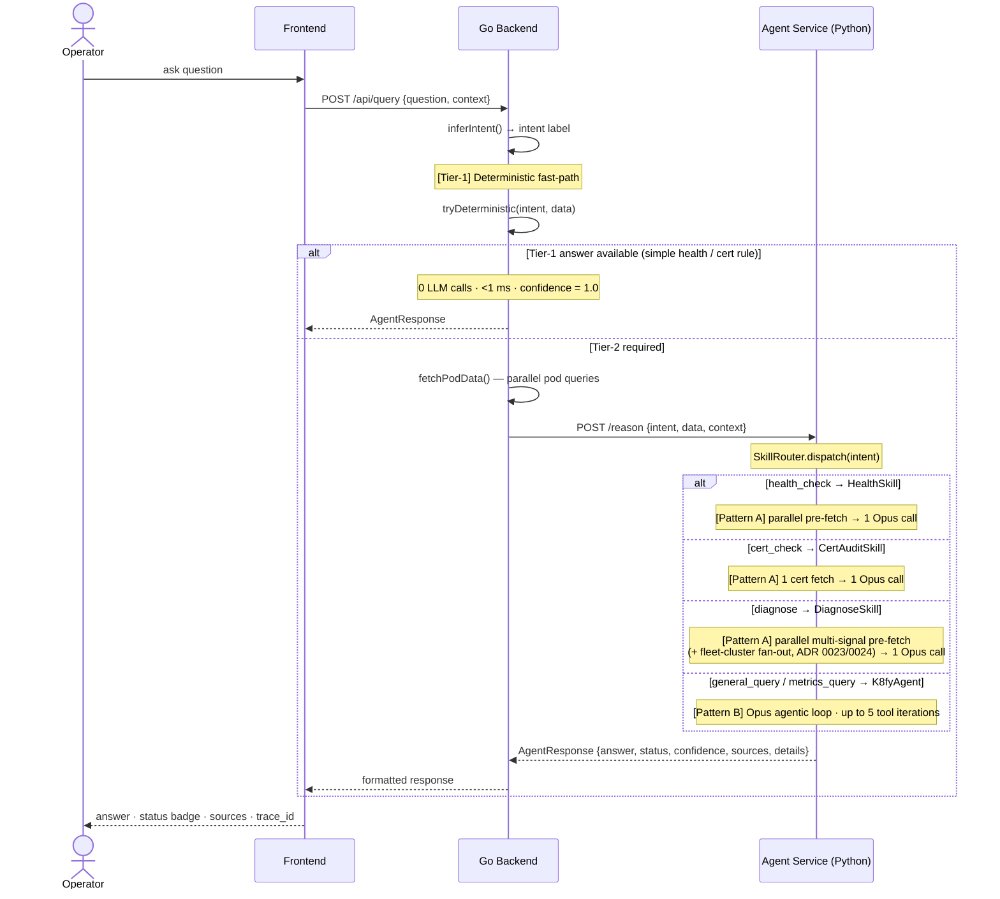
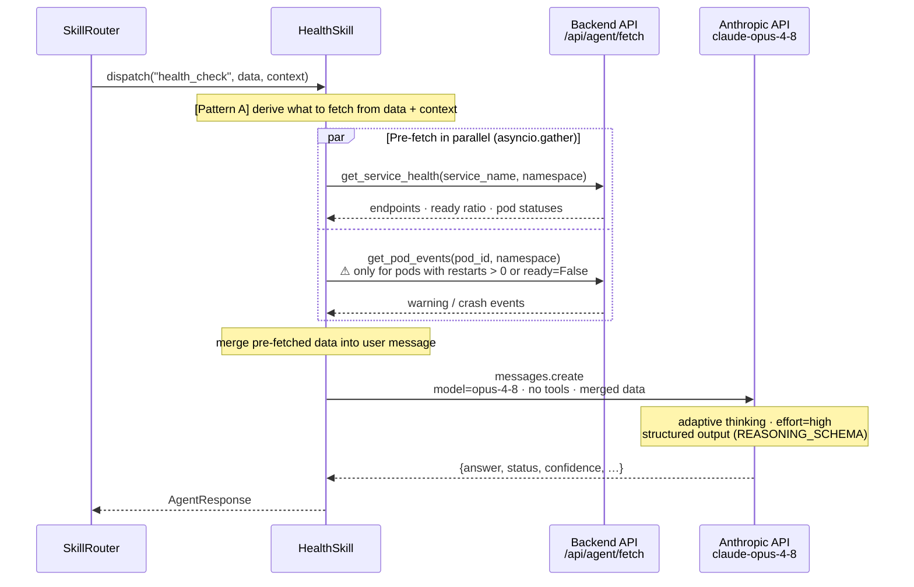
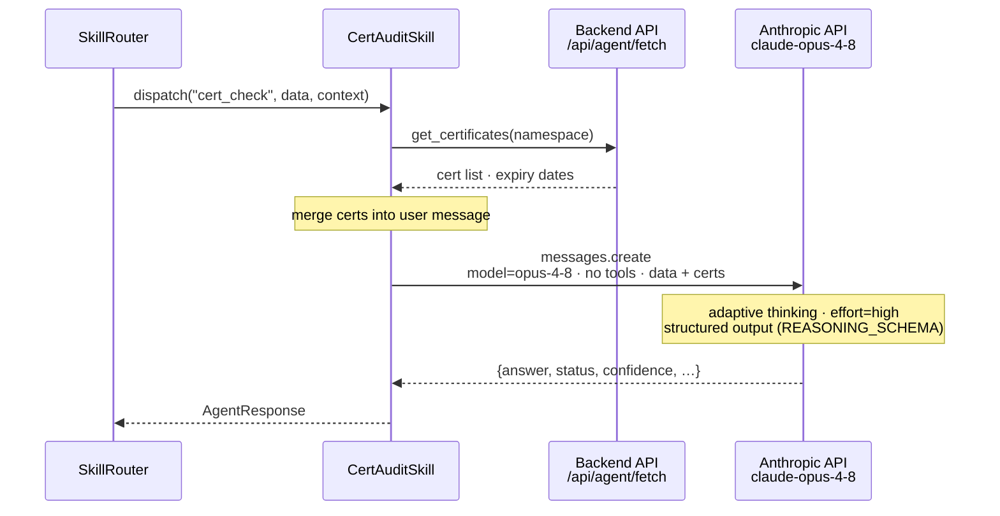
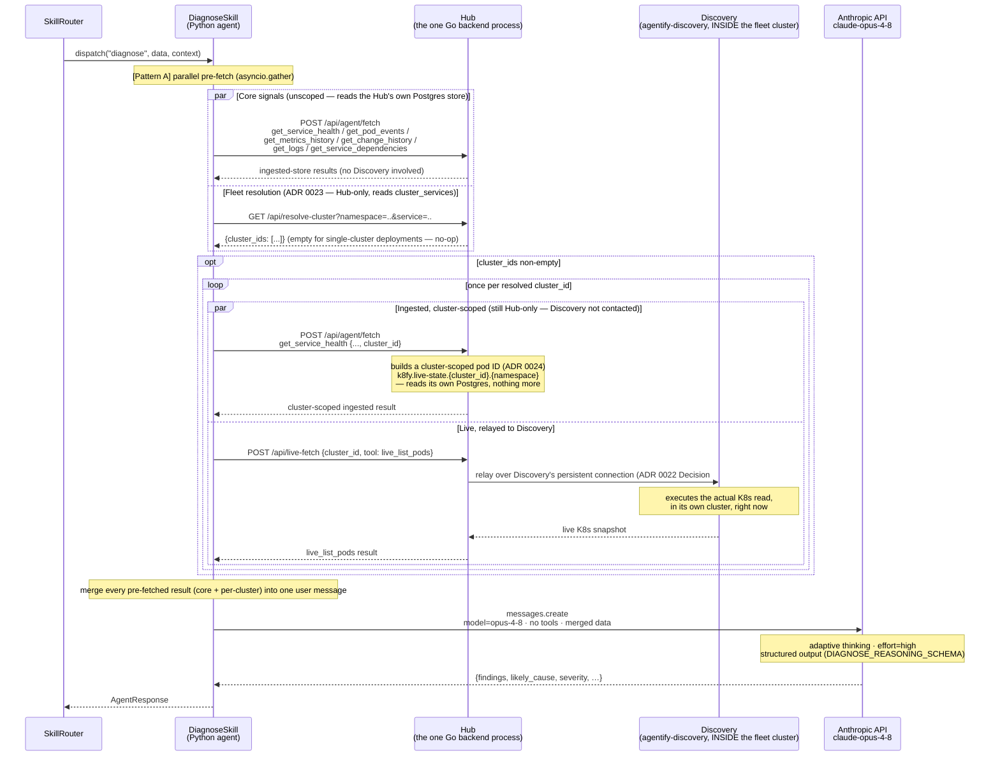
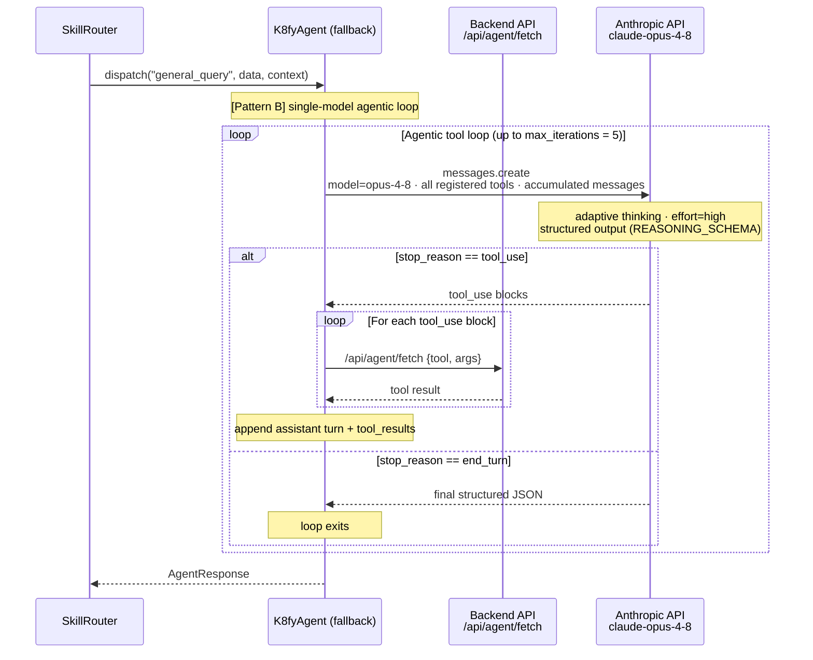
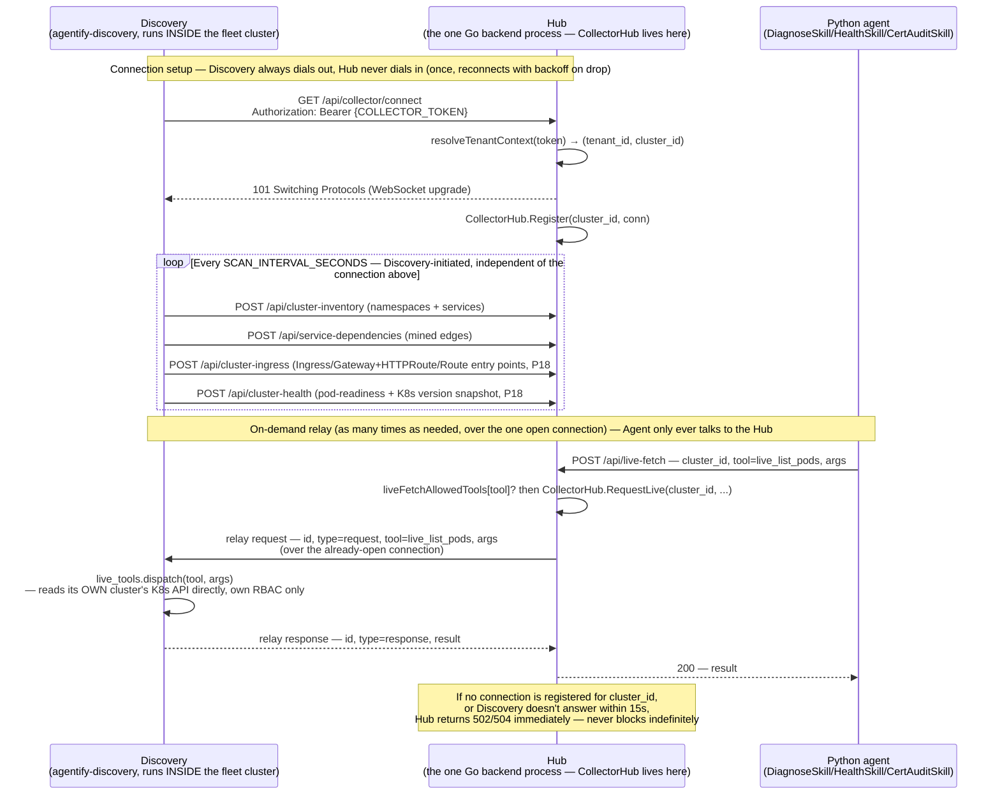
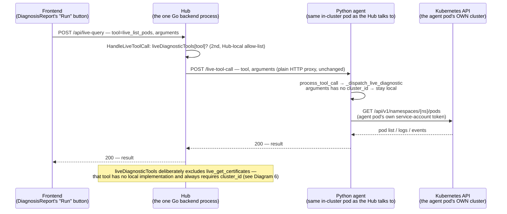

# Sequence Flows

End-to-end call sequences for every query path through the system.
Diagrams are in [Mermaid](https://mermaid.js.org) — rendered by GitHub, VS Code
(Mermaid Preview extension), and most documentation tools.

**Legend**
- **Solid arrow** (`->>`) — explicit code call / HTTP request
- **Dashed arrow** (`-->>`) — return / response
- **Dashed box** (`rect`) — server-side or parallel boundary
- `[Tier-1]` — deterministic, no LLM
- `[Tier-2]` — agentic, involves Claude
- `[Pattern A]` — parallel pre-fetch + single Claude call
- `[Pattern B]` — Claude-driven agentic tool loop

---

## 1. End-to-end overview — all paths

Shows the Tier-1 fast-path, the Tier-2 skill dispatch, and which strategy each
skill uses. Expand the per-skill diagrams below for internal detail.

---

## 2. Pattern A — HealthSkill (`health_check`)

Pre-fetches service health and degraded-pod events in parallel, then makes
exactly one Claude call. No agentic tool loop.

**Cost profile:** N parallel backend fetches (milliseconds, no billing) + **1 Opus call**.
Tool iterations recorded in Prometheus: **0**.

---

## 3. Pattern A — CertAuditSkill (`cert_check`)

The simplest Pattern A case. The cert list is the only data source and its
parameters are fully known from context — always one fetch, always one call.

**Cost profile:** 1 backend fetch + **1 Opus call**.
Tool iterations recorded in Prometheus: **0**.

---

## 4. Pattern A — DiagnoseSkill (`diagnose`), including fleet-cluster fan-out

**Superseded 2026-06-11 ([ADR 0026](../context-mesh/decisions/0026-pattern-a-skills-standardisation.md)):**
this used to be an agentic Sonnet-executor/Opus-advisor loop (same shape as
Diagram 5 below). `DiagnoseSkill` is now Pattern A like `HealthSkill`/
`CertAuditSkill`: every predictable signal is pre-fetched in parallel, then
exactly **one** Opus call reasons over all of it. As of ROADMAP P16/ADR 0024
(2026-08-03), the pre-fetch also resolves which of the tenant's fleet
clusters run the service being diagnosed and fans out a cluster-scoped
signal per match — [correlation.md](../context-mesh/policies/correlation.md)'s
existing rule (fan out, let Tier-2 synthesize/surface disagreement), not a
new mechanism.

Three distinct actors, deliberately kept as three separate lanes below (an
earlier version of this diagram conflated the Hub's `/api/agent/fetch` and
`/api/resolve-cluster`/`/api/live-fetch` handlers into two different
participants — they're the same one Go process; every "Hub" arrow below
lands in it):

**Cost profile:** N parallel backend/Hub fetches (milliseconds to low
seconds for a live relay hop, no LLM billing) + **1 Opus call**. Fleet
fan-out only adds cost for tenants with registered clusters — zero extra
calls otherwise. Tool iterations recorded in Prometheus: **0** (Pattern A
never loops).

---

## 5. Pattern B — K8fyAgent fallback (`general_query`, `metrics_query`)

Single-model agentic loop. No advisor tool. Claude decides which tools to call
based on the data and question.

**Cost profile:** N Opus calls (one per loop iteration). Tool iterations recorded in Prometheus: **actual count**.

---

## 6. Discovery ↔ Hub persistent connection (ROADMAP P18 use case #9, ADR 0022 Decision #7)

No LLM anywhere in this diagram — Discovery is deterministic, full stop.
This is the mechanism Diagram 4's "Fleet resolution"/live-relay boxes rely
on: Discovery connects to the Hub once and stays connected; the Hub relays
requests over that connection rather than ever dialing into a cluster
(which usually isn't reachable from the Hub — NAT, private VPC, firewall).
**Everything in this diagram happens either inside the cluster (Discovery)
or inside the one central process (Hub)** — there's no third location.
**This is not the only path a live diagnostic tool call can take** — see
Diagram 7 for the shorter one the Chat UI's "Run" buttons actually use, and
the one field (`cluster_id`) that decides between them.

**Why this shape:** periodic push (inventory/dependencies) stays plain HTTP
POST — it already worked and didn't need the persistent channel. Only
on-demand request/response traffic uses the WebSocket. See the ADR 0022
amendment (2026-08-03) for why these weren't unified onto one connection.

**Code references**

| Hop | File | What it does |
|-----|------|---------------|
| Connection setup | [`handlers.go:2096`](../src/backend/internal/api/handlers.go#L2096) `HandleCollectorConnect` | Upgrades to WebSocket, registers the connection under `cluster_id` |
| Connection setup | [`live_relay.py:71`](../src/adapters/discovery/live_relay.py#L71) `run_forever` | Dials out, reconnects with capped backoff on drop |
| Agent → Hub | [`handlers.go:2155`](../src/backend/internal/api/handlers.go#L2155) `HandleLiveFetch` | Requires `cluster_id`; checks `liveFetchAllowedTools` |
| Hub → Discovery | [`collector_hub.go:152`](../src/backend/internal/api/collector_hub.go#L152) `CollectorHub.RequestLive` | Writes a WS frame over the already-open connection, awaits the matching response by `id` |
| Discovery execution | [`live_tools.py:64`](../src/adapters/discovery/live_tools.py#L64) `dispatch()` | K8s API call against Discovery's own cluster, own RBAC |

---

## 7. Chat "Run" button — direct live-tool-call (no collector relay)

No LLM anywhere in this diagram either, and — unlike Diagram 6 — **no
Discovery collector, no WebSocket, no `cluster_id`.** This is the path a
recommended action's "Run" button takes: three plain HTTP hops, ending in
the agent pod calling the Kubernetes API of the *cluster it itself runs
in*.

> [!TIP]
> **What actually runs when you click "Run":** Frontend → Hub (thin proxy)
> → Agent's own in-cluster K8s call. The Discovery collector and its
> persistent WebSocket (Diagram 6) are never touched — that path only
> activates when a query names a `cluster_id`, which recommended actions
> built by the chat-structuring prompt never populate.

**Why this shape:** the Chat UI's recommended actions are meant for
quick, no-LLM confirmation of what a diagnosis already found — adding
fleet-cluster resolution here would cost a `resolve_service_clusters` round
trip for the common case (single-cluster deployments, or a query about the
same cluster the agent already runs in) where it can only ever be a no-op.
`DiagnoseSkill`'s own prefetch (Diagram 4) is the one caller that resolves
`cluster_id` and can hand it to `_dispatch_live_diagnostic` — a hand-built
`arguments` dict with `cluster_id` set would also take Diagram 6's relay
path through this exact same function, but no code path from the Chat "Run"
button constructs one today.

**Code references**

| Hop | File | What it does |
|-----|------|---------------|
| Frontend → Hub | [`api.ts:169`](../src/frontend/src/api.ts#L169) `runLiveTool()` | POSTs to `/api/live-query` |
| Hub proxy | [`handlers.go:1466`](../src/backend/internal/api/handlers.go#L1466) `HandleLiveToolCall` | Allow-list check (`liveDiagnosticTools`), then forwards as-is |
| Hub → Agent | [`agent_client.go:108`](../src/backend/internal/api/agent_client.go#L108) `AgentClient.LiveToolCall` | Plain HTTP POST — no `cluster_id` added |
| Agent dispatch | [`tools.py:578`](../src/agent/k8fy/tools.py#L578) `_dispatch_live_diagnostic` | Branches on whether `cluster_id` is in `arguments` |
| Recommended-action arguments | [`prompts.py:395`](../src/agent/k8fy/prompts.py#L395) `CHAT_STRUCTURE_PROMPT` | Only ever fills `namespace`/`pod` — never `cluster_id` |
| Local execution | [`live_diagnostics.py`](../src/agent/k8fy/live_diagnostics.py) | Direct in-cluster K8s API call, agent pod's own service account |

### Diagram 6 vs. Diagram 7 — which one actually runs

| | Diagram 6 — fleet relay | Diagram 7 — direct |
|---|---|---|
| **Trigger** | `cluster_id` present in `arguments` | `cluster_id` absent |
| **Caller** | `DiagnoseSkill`'s fleet fan-out (ADR 0023/0024) | Chat UI's "Run" button on a recommended action |
| **Hops** | Agent → Hub → Discovery → K8s API (a *different* cluster) | Frontend → Hub → Agent → K8s API (the *same* cluster the agent runs in) |
| **Connection** | Persistent WebSocket, opened once (`/api/collector/connect`) | Plain HTTP, one request per call |
| **Allow-lists** | `liveFetchAllowedTools` (Hub) + `live_tools.LIVE_TOOLS` (Discovery) | `liveDiagnosticTools` (Hub) + `LIVE_DIAGNOSTIC_TOOLS` (Agent) |
| **`live_get_certificates`** | Supported — the only path it has | Not supported (no local implementation) |

---

## Summary comparison

| Path | Skill | LLM calls | Tool loop | Fleet fan-out (ADR 0023/0024) | Models |
|------|-------|-----------|-----------|--------------------------------|--------|
| Tier-1 | — | **0** | no | no | — |
| Pattern A | HealthSkill | **1** | no | yes | Opus 4.8 |
| Pattern A | CertAuditSkill | **1** | no | yes | Opus 4.8 |
| Pattern A | DiagnoseSkill | **1** | no | yes | Opus 4.8 |
| Pattern B | K8fyAgent (fallback) | **1–N** (Opus) | yes | no | Opus 4.8 |

"Fleet fan-out" means the skill calls `resolve_service_clusters` and adds a
cluster-scoped prefetch task per matching cluster — a no-op (zero extra
calls) for any deployment with no registered fleet clusters.
