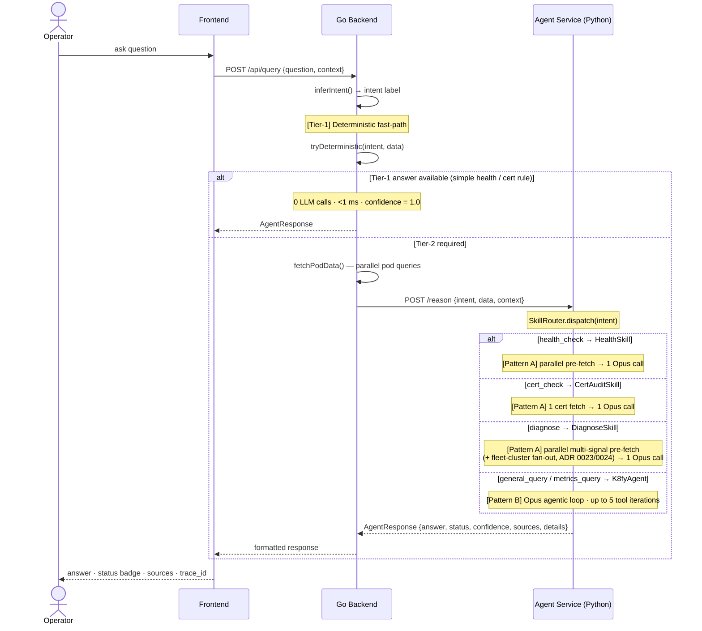
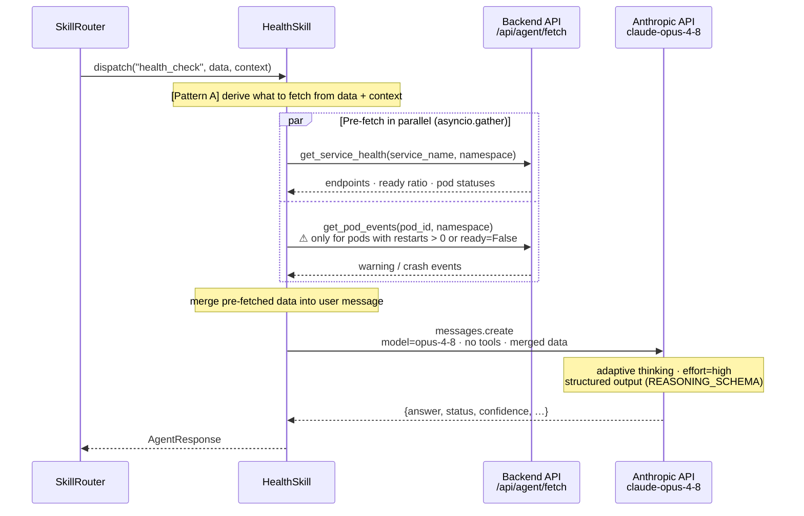
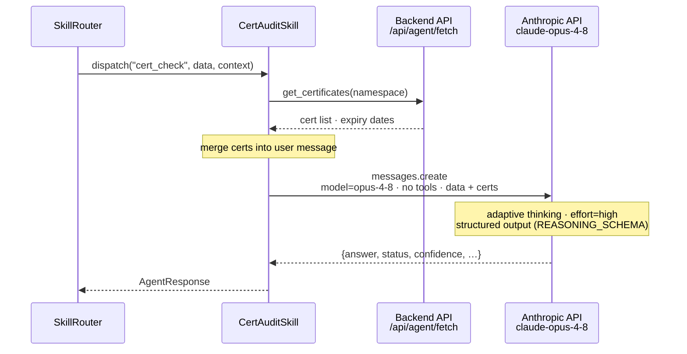
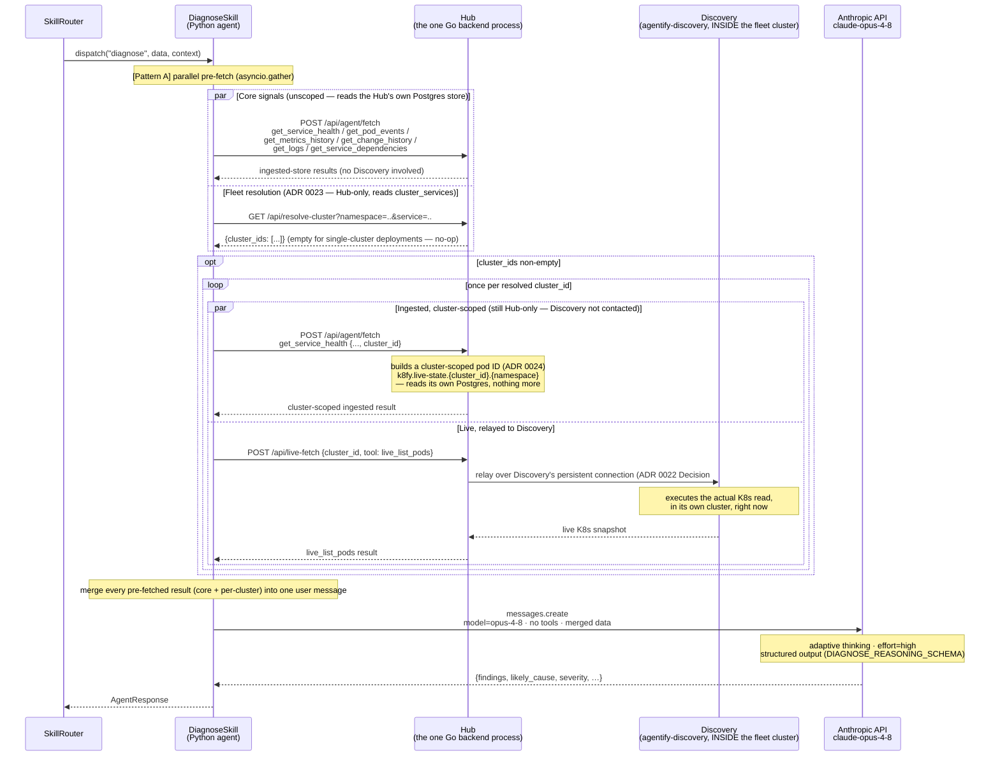
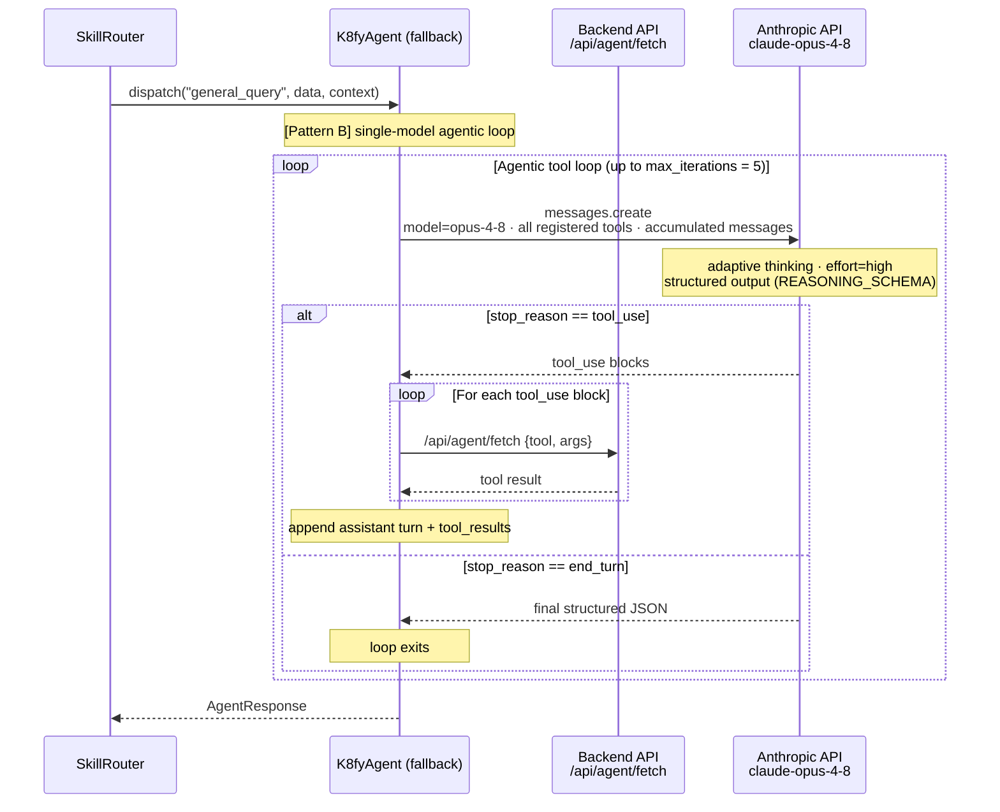
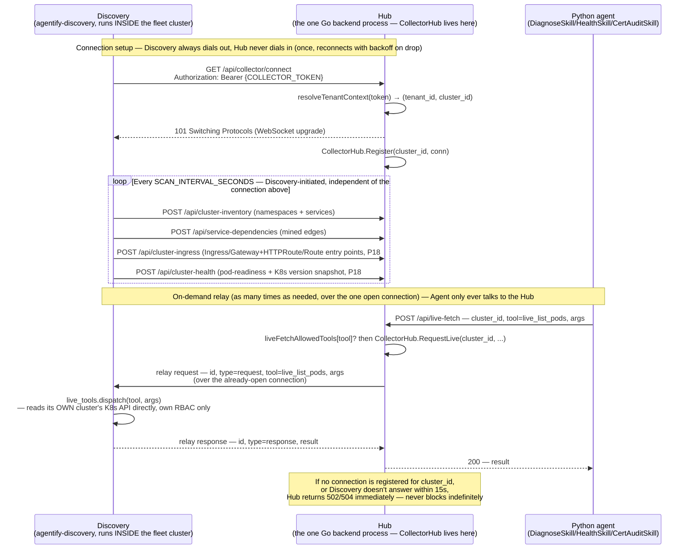
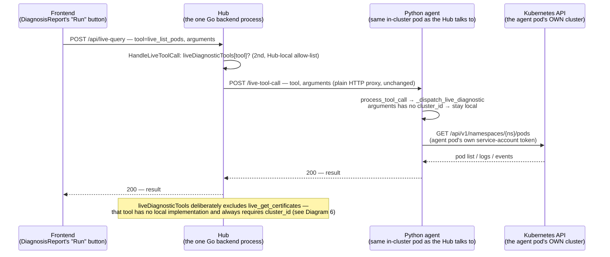
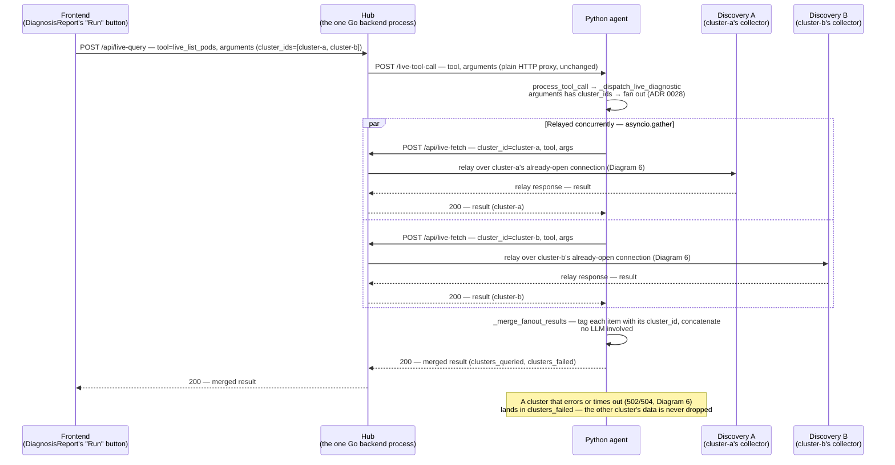

# Sequence Flows

End-to-end call sequences for every query path through the system.
Diagrams are in [Mermaid](https://mermaid.js.org) — rendered by GitHub, VS Code
(Mermaid Preview extension), and most documentation tools.

**Legend**
- **Solid arrow** (`->>`) — explicit code call / HTTP request
- **Dashed arrow** (`-->>`) — return / response
- **Dashed box** (`rect`) — server-side or parallel boundary
- `[Tier-1]` — deterministic, no LLM
- `[Tier-2]` — agentic, involves Claude
- `[Pattern A]` — parallel pre-fetch + single Claude call
- `[Pattern B]` — Claude-driven agentic tool loop

---

> These diagrams answer **"in what order, for one path"**. For **"what exists,
> and which parts does each flow touch"**, open
> [`architecture-map.html`](architecture-map.html) — one component map with all
> 16 flows overlaid on demand, including the ones with no sequence diagram here
> (mining, remediation, semantic memory, the prompt gate).

## 1. End-to-end overview — all paths

Shows the Tier-1 fast-path, the Tier-2 skill dispatch, and which strategy each
skill uses. Expand the per-skill diagrams below for internal detail.

---

## 2. Pattern A — HealthSkill (`health_check`)

Pre-fetches service health and degraded-pod events in parallel, then makes
exactly one Claude call. No agentic tool loop.

**Cost profile:** N parallel backend fetches (milliseconds, no billing) + **1 Opus call**.
Tool iterations recorded in Prometheus: **0**.

---

## 3. Pattern A — CertAuditSkill (`cert_check`)

The simplest Pattern A case. The cert list is the only data source and its
parameters are fully known from context — always one fetch, always one call.

**Cost profile:** 1 backend fetch + **1 Opus call**.
Tool iterations recorded in Prometheus: **0**.

---

## 4. Pattern A — DiagnoseSkill (`diagnose`), including fleet-cluster fan-out

**Superseded 2026-06-11 ([ADR 0026](../context-mesh/decisions/0026-pattern-a-skills-standardisation.md)):**
this used to be an agentic Sonnet-executor/Opus-advisor loop (same shape as
Diagram 5 below). `DiagnoseSkill` is now Pattern A like `HealthSkill`/
`CertAuditSkill`: every predictable signal is pre-fetched in parallel, then
exactly **one** Opus call reasons over all of it. As of ROADMAP P16/ADR 0024
(2026-08-03), the pre-fetch also resolves which of the tenant's fleet
clusters run the service being diagnosed and fans out a cluster-scoped
signal per match — [correlation.md](../context-mesh/policies/correlation.md)'s
existing rule (fan out, let Tier-2 synthesize/surface disagreement), not a
new mechanism.

Three distinct actors, deliberately kept as three separate lanes below (an
earlier version of this diagram conflated the Hub's `/api/agent/fetch` and
`/api/resolve-cluster`/`/api/live-fetch` handlers into two different
participants — they're the same one Go process; every "Hub" arrow below
lands in it):

**Cost profile:** N parallel backend/Hub fetches (milliseconds to low
seconds for a live relay hop, no LLM billing) + **1 Opus call**. Fleet
fan-out only adds cost for tenants with registered clusters — zero extra
calls otherwise. Tool iterations recorded in Prometheus: **0** (Pattern A
never loops).

---

## 5. Pattern B — K8fyAgent fallback (`general_query`, `metrics_query`)

Single-model agentic loop. No advisor tool. Claude decides which tools to call
based on the data and question.

**Cost profile:** N Opus calls (one per loop iteration). Tool iterations recorded in Prometheus: **actual count**.

---

## 6. Discovery ↔ Hub persistent connection (ROADMAP P18 use case #9, ADR 0022 Decision #7)

No LLM anywhere in this diagram — Discovery is deterministic, full stop.
This is the mechanism Diagram 4's "Fleet resolution"/live-relay boxes rely
on: Discovery connects to the Hub once and stays connected; the Hub relays
requests over that connection rather than ever dialing into a cluster
(which usually isn't reachable from the Hub — NAT, private VPC, firewall).
**Everything in this diagram happens either inside the cluster (Discovery)
or inside the one central process (Hub)** — there's no third location.
**This is not the only path a live diagnostic tool call can take** — see
Diagram 7 for the shorter one the Chat UI's "Run" buttons actually use, and
the one field (`cluster_id`) that decides between them.

**Why this shape:** periodic push (inventory/dependencies) stays plain HTTP
POST — it already worked and didn't need the persistent channel. Only
on-demand request/response traffic uses the WebSocket. See the ADR 0022
amendment (2026-08-03) for why these weren't unified onto one connection.

**Code references**

| Hop | File | What it does |
|-----|------|---------------|
| Connection setup | [`handlers.go:2096`](../src/backend/internal/api/handlers.go#L2096) `HandleCollectorConnect` | Upgrades to WebSocket, registers the connection under `cluster_id` |
| Connection setup | [`live_relay.py:71`](../src/adapters/discovery/live_relay.py#L71) `run_forever` | Dials out, reconnects with capped backoff on drop |
| Agent → Hub | [`handlers.go:2155`](../src/backend/internal/api/handlers.go#L2155) `HandleLiveFetch` | Requires `cluster_id`; checks `liveFetchAllowedTools` |
| Hub → Discovery | [`collector_hub.go:152`](../src/backend/internal/api/collector_hub.go#L152) `CollectorHub.RequestLive` | Writes a WS frame over the already-open connection, awaits the matching response by `id` |
| Discovery execution | [`live_tools.py:64`](../src/adapters/discovery/live_tools.py#L64) `dispatch()` | K8s API call against Discovery's own cluster, own RBAC |

---

## 7. Chat "Run" button — direct live-tool-call (no collector relay)

No LLM anywhere in this diagram either, and — unlike Diagram 6 — **no
Discovery collector, no WebSocket.** This is the path a recommended
action's "Run" button takes *when the discussed service resolves to no
fleet cluster* (a single-cluster deployment, or nothing registered yet):
three plain HTTP hops, ending in the agent pod calling the Kubernetes API
of the *cluster it itself runs in*. See Diagram 8 for what happens instead
when the service **does** resolve to one or more fleet clusters — ADR 0028
closed the gap this diagram originally documented (recommended actions
never carrying a `cluster_id` at all).

> [!TIP]
> **This is the fallback path, not the default one (as of ADR 0028).**
> `_structure_chat_answer` now resolves the discussed service's fleet
> cluster(s) before building each Run button. Zero resolved → this diagram
> (local, unchanged). One resolved → Diagram 6's relay, targeted. Two or
> more resolved → Diagram 8's fan-out. Only the first case reaches this
> diagram's local K8s call.

**Why this shape:** the Chat UI's recommended actions are meant for
quick, no-LLM confirmation of what a diagnosis already found. Before ADR
0028, adding fleet-cluster resolution here would have cost a
`resolve_service_clusters` round trip on every response regardless of
whether it could ever matter — so it was skipped, and this diagram was
the *only* path, correct only by accident for single-cluster deployments.
ADR 0028 pays that round trip once per response (not per action) and only
when the response actually produced a recommended action *and* `context`
carries both `namespace` and `service` — this diagram is now specifically
the **zero-clusters-resolved** outcome of that lookup, not the only
outcome.

**Code references**

| Hop | File | What it does |
|-----|------|---------------|
| Frontend → Hub | [`api.ts:169`](../src/frontend/src/api.ts#L169) `runLiveTool()` | POSTs to `/api/live-query` |
| Hub proxy | [`handlers.go:1466`](../src/backend/internal/api/handlers.go#L1466) `HandleLiveToolCall` | Allow-list check (`liveDiagnosticTools`), then forwards as-is |
| Hub → Agent | [`agent_client.go:108`](../src/backend/internal/api/agent_client.go#L108) `AgentClient.LiveToolCall` | Plain HTTP POST — no `cluster_id` added |
| Agent dispatch | [`tools.py:629`](../src/agent/k8fy/tools.py#L629) `_dispatch_live_diagnostic` | Branches on `cluster_ids` (fan-out, Diagram 8) → `cluster_id` (relay, Diagram 6) → local (this diagram) |
| Cluster resolution (ADR 0028) | [`agent.py:829`](../src/agent/k8fy/agent.py#L829) `_structure_chat_answer` | Calls `resolve_service_clusters` once per response, injects `cluster_id`/`cluster_ids` per action |
| Local execution | [`live_diagnostics.py`](../src/agent/k8fy/live_diagnostics.py) | Direct in-cluster K8s API call, agent pod's own service account |

### Diagram 6 vs. 7 vs. 8 — which one actually runs

| | Diagram 6 — fleet relay | Diagram 7 — direct (this one) | Diagram 8 — fan-out |
|---|---|---|---|
| **Trigger** | Exactly 1 cluster resolved (or a pod-specific action with 2+, best-effort — ADR 0028) | 0 clusters resolved, or `service` missing from context | 2+ clusters resolved and the action has no `pod` |
| **Caller** | `DiagnoseSkill`'s fleet fan-out (ADR 0023/0024), or a resolved Run-button action (ADR 0028) | Chat UI's "Run" button, resolution found nothing | Chat UI's "Run" button, resolution found several |
| **Hops** | Agent → Hub → Discovery → K8s API (a *different* cluster) | Frontend → Hub → Agent → K8s API (the *same* cluster the agent runs in) | Agent → Hub → Discovery, **N times in parallel**, merged in the Agent |
| **Connection** | Persistent WebSocket, opened once (`/api/collector/connect`) | Plain HTTP, one request per call | N persistent WebSockets, each already open (Diagram 6) |
| **Merge** | N/A — single result | N/A — single result | Deterministic concatenate + tag by `cluster_id` (`_merge_fanout_results`) — no LLM |
| **`live_get_certificates`** | Supported — the only path it has | Not supported (no local implementation) | Supported |

---

## 8. Chat "Run" button — fan-out across multiple fleet clusters (ADR 0028)

No LLM anywhere in this diagram either. This is what happens when the
service a recommended action targets resolves to **more than one** fleet
cluster and the action isn't pod-specific — a dependency that spans
clusters, not just namespaces. Diagram 6's per-cluster relay runs
**N times concurrently**, one per resolved cluster, all over connections
that are already open; the Agent merges the results before anything
reaches the operator.

**Why this shape:** the merge stays deterministic on purpose — Diagram
7/8's whole reason to exist is a fast, no-LLM re-check, so combining three
clusters' pod lists into one tagged list is a plain code operation, not a
second Claude call (`context-mesh/policies/correlation.md`'s LLM-synthesis
guidance is for combining a service's *own* signals before a diagnostic
call, a different problem). Pod-specific actions (`live_get_pod_logs`,
`live_describe_pod`) never take this path — a pod name is already
cluster-specific, so there's nothing to fan out to; those get a
best-effort single `cluster_id` instead (see ADR 0028).

**Code references**

| Hop | File | What it does |
|-----|------|---------------|
| Fan-out trigger | [`tools.py:629`](../src/agent/k8fy/tools.py#L629) `_dispatch_live_diagnostic` | Sees `cluster_ids`, calls `_remote_live_fetch` once per cluster via `asyncio.gather` |
| Per-cluster relay | [`tools.py:560`](../src/agent/k8fy/tools.py#L560) `_remote_live_fetch` | Unchanged — same function Diagram 6's single-cluster case already uses |
| Merge | [`tools.py`](../src/agent/k8fy/tools.py) `_merge_fanout_results` | Tags each item with `cluster_id`, concatenates, surfaces `clusters_failed` |
| Cluster resolution | [`agent.py:829`](../src/agent/k8fy/agent.py#L829) `_structure_chat_answer` | Attaches `cluster_ids` (plural) only when 2+ resolve and no `pod` is set |

---

## Summary comparison

| Path | Skill | LLM calls | Tool loop | Fleet fan-out (ADR 0023/0024) | Models |
|------|-------|-----------|-----------|--------------------------------|--------|
| Tier-1 | — | **0** | no | no | — |
| Pattern A | HealthSkill | **1** | no | yes | Opus 4.8 |
| Pattern A | CertAuditSkill | **1** | no | yes | Opus 4.8 |
| Pattern A | DiagnoseSkill | **1** | no | yes | Opus 4.8 |
| Pattern B | K8fyAgent (fallback) | **1–N** (Opus) | yes | no | Opus 4.8 |

"Fleet fan-out" means the skill calls `resolve_service_clusters` and adds a
cluster-scoped prefetch task per matching cluster — a no-op (zero extra
calls) for any deployment with no registered fleet clusters.
